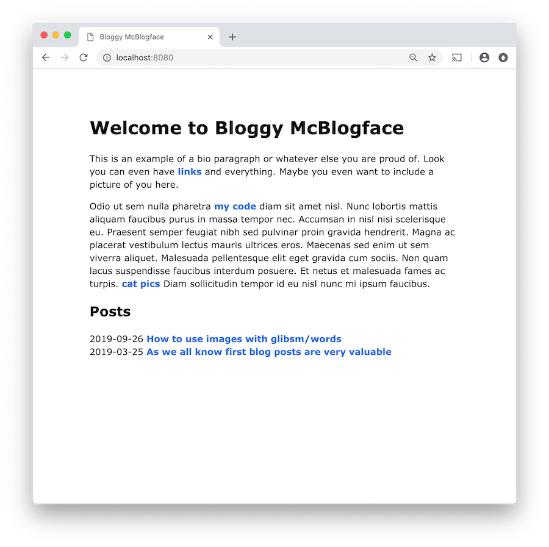

# Words blog example

You can see it live <https://words-example.gsmaga.com/>


This example demonstrates how to use `package words`.

Naming and placement of the files inside `posts/` does not matter, feel free to
choose whatever blogkeeping system works best for you and they will be
processed all the same.

```
❯ tree .
├── README.md
├── index.md
├── main.go
├── posts
│   ├── 2019
│   │   └── 03
│   │       └── this-name-does-not-matter.md
│   └── first.md
└── static
    └── images
        └── early-prototype.png
```

In order to work, posts require a metadata section ala jekyll. Don't worry, if
you forget the library will remind you with a helpful error message.

```
❯ head -5 posts/2019/03/this-name-does-not-matter.md
---
slug: yes-even-images
title: How to use images with glibsm/words
date: 2019-09-26
---
```

## Run

```
❯ go run main.go
2019/03/26 21:36:08 Applied 1 server options
2019/03/26 21:36:08 Created _build
2019/03/26 21:36:08 Wrote out _build/yes-even-images
2019/03/26 21:36:08 Wrote out _build/my-first-post
2019/03/26 21:36:08 Wrote out _build/index.html
2019/03/26 21:36:08 Copied over the static folder
2019/03/26 21:36:08 Listening on :8080
```

Now open `localhost:8080`
